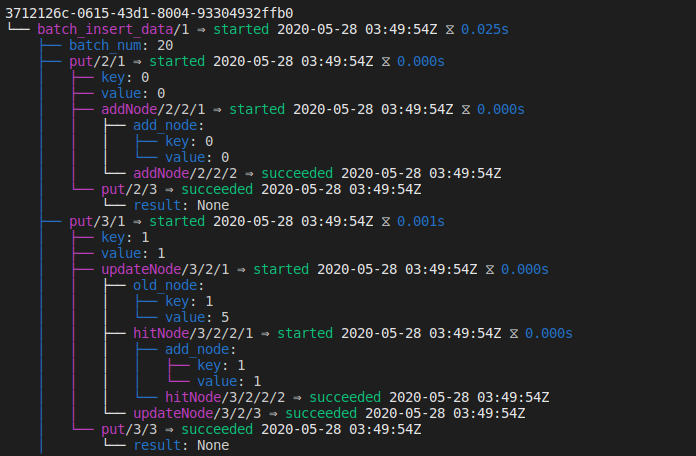
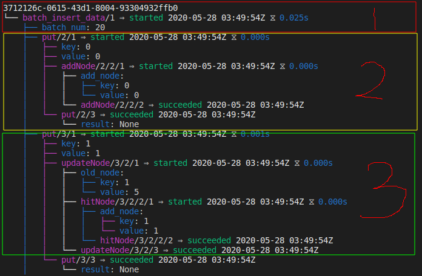
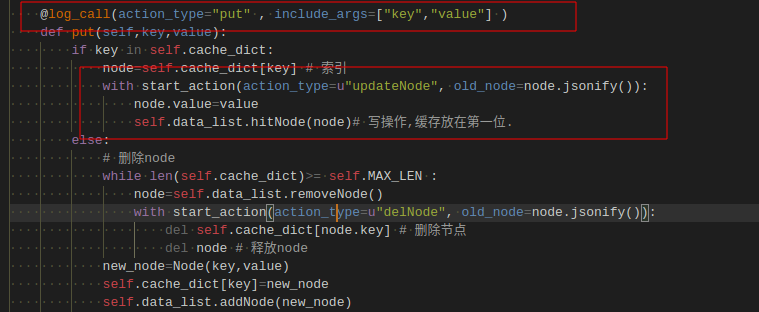

# eliot 日志使用说明

## eliot介绍

python 自带的logging 日志系统：输出当前的程序运行的结果。单单依赖于自带的日志系统，不能帮你解决

- 程序为何运行慢。
- 代码的运行路径是什么。(if-else 分支)
- 发生错误时，当前环境的上下文是什么。

eliot可以帮助程序员快速定位以上问题。https://eliot.readthedocs.io/en/stable/

## 示例说明

```
docker-compose run test-log-service
```

查看运行对应的代码lru_log.py:135 行 ：

```
   batch_num=20
    with start_action(action_type="batch_insert_data",batch_num=batch_num):
        for i in range(batch_num):
            lr.put(i%6, i)
```
当我们想LRU缓存插入20个key值时，LRU的程序的执行逻辑。

注意：当前 LRU是存在key=1 的缓存的。




```
3712126c-0615-43d1-8004-93304932ffb0
代表任务id，以树状结构显示。
batch_insert_data/1 表示任务开始，右侧的1 表示任务开始的第一步。
batch_num 表示参数
显示整个任务运行完成之后的耗时。
```


开始执行第一个任务
```
put(0,0)
可以显示后续的执行路径
```


开始执行第二个任务 
```
put(1,1)
可以显示后续的执行路径
udpateNode
hitNode
```


## 使用说明：

### 引入依赖
```
from eliot import start_action,log_call, to_file
to_file(stdout)
to_file(open("eliot.log", "ab"))
```

### 函数调用时使用 
```
@log_call(action_type="put" , include_args=["key","value"] )
```
### 函数执行时使用

```
            with start_action(action_type=u"updateNode", old_node=node.jsonify()):
                node.value=value
                self.data_list.hitNode(node)# 写操作,缓存放在第一位.
```


