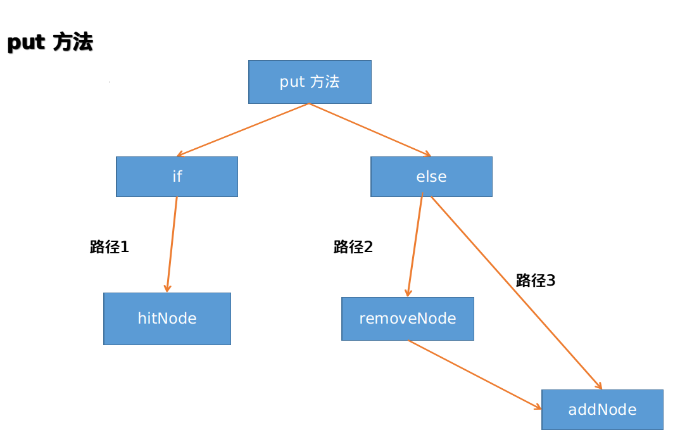

## 说明

LRU是Least Recently Used的缩写，即最近最少使用，是一种常用的缓存置换法，选择最近最久未使用的缓存予以淘汰。
本小项目通过python实现LRU算法,在此基础上进行以下练习.
- 单元测试案例的设计练习
- 探讨性能测试
- 测试Eliot日志软件

## 单元测试工作
tips: 主要工作是进行单元测试,数据功能性测试的一部分.

### 功能性测试-黑盒篇

基本情况如下:
- 缓存的最大长度为2
- 存数据:入口参数是 key,value int类型
- 取数据:入口参数是key  返回为 value 或者-1

设计测试案例之前需要先想好测试案例的等价类(一个等价类代表测试逻辑是相同的,测一个通过后,测试另外的也会通过),


#### 正常情况

- 测试案例-新增数据-01

新增数据:放入一条数据,取一条数据.

```
put(1,2)
get(1)
```
预期值为2.

- 测试案例-更新数据-02

更新数据:放入一条数据,更新数据的值.

```
put(1,2)
get(1)
put(1,3)
get(1)
```

- 测试案例-超过长度-03
超过LRU的最大长度时,能否正确工作.

边界测试:插入三个数据

```
put(1,2)
put(2,3)
put(3,4)
get(3)
```


#### 异常情况

- 测试案例-长度为0-04  
考虑到了边界情况.

LRU长度为0时,取数据发现数据时,返回-1

```
get(4)
```

- 测试案例-取失效数据-05

取失效数据: 原来存在该数据,但是随着新增数据,导致原来的数据失效.

```
put(1,2)
put(2,3)
put(3,4)
get(1)
```

- 测试案例-取不存在的数据-06

取不存在的数据 : 获取的数据根本不存在的情况

测试案例-06 与 测试案例-04 类似,但是04更多考虑了边界值测试,06可以进行测试.

```
put(1,2)
put(2,3)
put(3,4)
get(4)
```

#### 其他情况

LRU 的长度 <=0 的边界值测试

```
LRU(0)
lru_obj.put(1, 2)
```
会引起一个异常,见白盒测试的put方法测试路径2 .
想说的话,代码的完善性是需要通过测试案例去保障.

见 test_other_except_07


### 功能性测试-白盒篇
https://zh.wikipedia.org/wiki/%E7%99%BD%E7%9B%92%E6%B5%8B%E8%AF%95

由于代码比较简单所以采用最为覆盖最全的路径测试方案.
路径覆盖的含义是，选取足够多的测试数据，使程序的每条可能路径都至少执行一次（如果程序图中有环，则要求每个环至少经过一次）。


#### LRU的put 方法的路径



- 测试案例-put-路径01-01

```
put(1,2)
put(1,4)

检查 head的next节点的value否是4.
```


- 测试案例-put-路径02-02


```

put(1,2)
put(2,4)
put(3,5)

检查 
链表中(3,5)是否放在前面.
链表中(1,2)是否被删除掉.
字典中key=1 是否删除.
```

- 测试案例-put-路径03-03

```
put(1,2)
put(2,4)

检查 
链表中(2,4)是否放在前面.
```
#### LRU的get 方法的路径


- 测试案例-get-路径01-01
顺利拿到值

```
put(1,2)
get(1)
```

- 测试案例-get-路径01-02

值不存在

```
put(1,2)
get(2)
```


